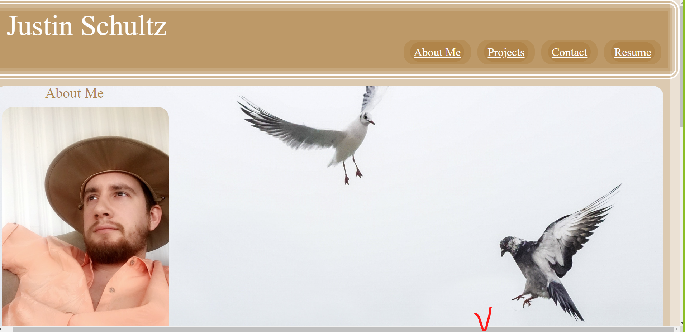

# Justin Portfolio
Description
This webpage is designed to showcase Justin Schultz as a web-developer to potential employers. The portfolio consist of a main header, about Justin Schultz, 5 Main projects he has done, and a way to contact him, and download a resume.

Installation N/A

Usage
This webpage was designed for prospective employers get an overview of Justin Schultz, web developer

Credits
 courses.bootcampspot.com https://developer.mozilla.org/en-US/docs/Web/HTML/Element
 https://meyerweb.com/eric/tools/css/reset/ - for reset css file
https://www.codexworld.com/embed-pdf-document-file-in-html-web-page/- for embedding pdf.
https://www.pexels.com/ - for stock images

License MIT License

Copyright (c) 2023 justin-schultz37

Permission is hereby granted, free of charge, to any person obtaining a copy of this software and associated documentation files (the "Software"), to deal in the Software without restriction, including without limitation the rights to use, copy, modify, merge, publish, distribute, sublicense, and/or sell copies of the Software, and to permit persons to whom the Software is furnished to do so, subject to the following conditions:

The above copyright notice and this permission notice shall be included in all copies or substantial portions of the Software.

THE SOFTWARE IS PROVIDED "AS IS", WITHOUT WARRANTY OF ANY KIND, EXPRESS OR IMPLIED, INCLUDING BUT NOT LIMITED TO THE WARRANTIES OF MERCHANTABILITY, FITNESS FOR A PARTICULAR PURPOSE AND NONINFRINGEMENT. IN NO EVENT SHALL THE AUTHORS OR COPYRIGHT HOLDERS BE LIABLE FOR ANY CLAIM, DAMAGES OR OTHER LIABILITY, WHETHER IN AN ACTION OF CONTRACT, TORT OR OTHERWISE, ARISING FROM, OUT OF OR IN CONNECTION WITH THE SOFTWARE OR THE USE OR OTHER DEALINGS IN THE SOFTWARE.
